## Project: Build a Traffic Sign Recognition Program

#**Traffic Sign Recognition**
**Build a Traffic Sign Recognition Project**
This project aims at using neural networks to design a traffic sign classifier.
1. The neural network is trained on the German Traffic Sign data set.
2. A modification of the LeNet architecture is used to train the model.
3. In order to improve the training accuracy, image pre-processing and data augmentation is done prior to training.
4. The trained model is then tested on a test data set and also on five new traffic sign images found on the web.

Read on to know more about each of these steps.
## Rubric Points
###Here I will consider the [rubric points](https://review.udacity.com/#!/rubrics/481/view) individually and describe how I addressed each point in my implementation.  

---
###Writeup / README

####1. This write-up gives an in-depth explanation of each stage of the project and links it to the respective section in the project code.
Here is a link to my [project code](https://github.com/preethi2205/TrafficSignClassification/blob/master/Traffic_Sign_Classifier.ipynb)

###Data Set Summary & Exploration

####1. The German traffic data set contains a training set, a validation set and a test set. Each data set contains a number of images and their respective labels.

The code for this step is contained in the second code cell of the IPython notebook.  I used the numpy library to calculate the following information about the traffic signs data set:

* The training set consists of 34799 images
* The validation set consists of images 4410 images
* The test set consists of 12630 images
* The shape of a traffic sign image is (32,32,3)
* The number of unique classes/labels in the data set is 43

####2. Visualizing a random image in the data set gives an idea of what the training set looks like.

The code for this step is contained in the third code cell of the IPython notebook.  

Here is a random image from the training set

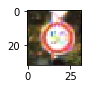

###Design and Test a Model Architecture

####1. Image pre-processing

The code for this step is contained in the fourth code cell of the IPython notebook. This code snippet defines a function called ImagePreProcessing that can be used on the training, validation and test data sets.

The first thing I noticed about the images in the training set was that some of them contained really dark pixels. It was hard to distinguish the traffic sign from the background in many cases. The natural next step seemed to be to improve the contrast of these images. I used histogram equalization on each of the color channels to achieve this. Below is an example of the original image and the image after histogram equalization.

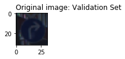
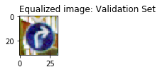

The next thought was to make it easier on the neural network to identify certain features such as lines and edges. These are color independent features. They can be easily identified using a gray scale image. Thus, the next step in data pre-processing was to convert the images to gray scale. Below is an example of an image converted to gray scale.

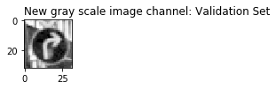

However, the gray scale image alone is not enough to classify the traffic signs, as the color of the traffic sign gives it a specific meaning. So, I added the gray scale image as an addition channel to the existing R,G,B channels.

As a last step, I normalized the image data to values between 0 and 1. This is done in order to make it easier for the neural network weights to train. Large pixel data usually means a larger search range for weights, thus making the optimization problem harder.

####2. Data augmentation
The training set containing 34799 images and the validation set containing 4410 images was given to us. The next step is to include additional data in the training set to improve training accuracy.

The sixth code cell of the IPython notebook contains the code for augmenting the data set. In practice, the traffic sign images that need to be classified may be noisy. Some of the reasons could be blurring due to image capture from a moving vehicle, shifting/ rotation due to the camera sensor's position while capturing the image. In order to account for these possible variations in the input image, I created a new training data set by adding median blur to the existing images. I considered adding a simple blur, a Gaussian blur and a median blur. While the simple blur added too much noise to such a small image (32,32), the Gaussian blur had almost no effect. The median blur added noticeable noise and also modified the color channels, thus adding extra complexity for the neural network. Appending this blurred data set to the original training set results in a training set that is double the original size.

The following is an example of an image with median blur applied to it:

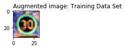

####3. Modified LeNet model definition for traffic sign classification

The final model used for training is a slight modification of the LeNet architecture. The code for my final model is located in the ninth cell of the ipython notebook. The two main modifications were:
1. Each convolution layer has a deeper output than the original architecture (more number of channels for identifying more features)
2. A 1x1 convolution layer is added in between the two original layers to introduce depth to the architecture.

My final model consisted of the following layers:

| Layer         		|     Description	        					|
|:---------------------:|:---------------------------------------------:|
| Input         		| 32x32x3 RGB image   							|
| Convolution         	| 1x1 stride, same padding, outputs 28x28x16    |
| RELU					|												|
| Max pooling	      	| 2x2 stride,  outputs 14x14x16 				|
| Convolution    	    | 1x1 stride, same padding, outputs 14x14x32    |      									| RELU                  |                                               |
| Convolution    	    | 1x1 stride, same padding, outputs 10x10x64    |      									| RELU                  |                                               |
| Max pooling	      	| 2x2 stride,  outputs 5x5x64 				    |
| Fully connected		| Input: 1600, Output: 200   					|
| RELU                  |                                               |
| Fully connected		| Input: 84, Output: 43   					    |
| RELU                  |                                               |

####4. Training the model

The code for training the model is located in the thirteenth to fifteenth cells of the ipython notebook.

The loss operation needed to train the model is defined in the thirteenth code cell. I used an Adam optimizer to train the model. The advantage of an Adam optimizer is that the learning rate is adjusted (exponentially decreasing) according to the progress of the optimization.

Cell number fourteen defines a method to calculate the training and validation loss and accuracy for each epoch. The accuracy function is derived by comparing the output of the model to the labels for each training run. The accuracy and loss are calculated for each batch and the average accuracy and loss are returned as outputs.

The actual training is done in the fifteenth code cell. Training is done in batches of 128 samples. The training is run for 30 epochs. The training accuracy and validation accuracy and losses are calculated for each epoch. The trained model is then saved.

Code cells sixteen and seventeen are used to plot the trend in training accuracy, validation accuracy, training loss and validation loss. These plots were very useful while tuning the model for better accuracy.

####5. Describe the approach taken for finding a solution. Include in the discussion the results on the training, validation and test sets and where in the code these were calculated. Your approach may have been an iterative process, in which case, outline the steps you took to get to the final solution and why you chose those steps. Perhaps your solution involved an already well known implementation or architecture. In this case, discuss why you think the architecture is suitable for the current problem.
The code for calculating the accuracy of the model is located in the ninth cell of the Ipython notebook.

My final model results were:
* training set accuracy of 99%
* validation set accuracy of 94.5%
* test set accuracy of 92.4%

An iterative approach was chosen to get a high training and validation accuracy.

**Modifying the Architecture
* The LeNet architecture was a good starting point to classify the traffic sign images.
* On training the LeNet architecture, a training accuracy of around 88% was achieved within 10 epochs.
* The next step was to run the LeNet training for more number of epochs to see if the accuracy improved. However, the training accuracy remained at about 88%.
*  The first thing I tried in order to improve the accuracy was to add depth to the convolution layers. Greater the number of channels, more the number of features identified. I modified the output of the first convolution layer to be 16, and the second convolution layer to be 32.
* This resulted in the training accuracy to go to 100% within a few epochs, thus suggesting a high learning rate.
* I then tried to reduce the learning rate to see if a slower convergence could be achieved. A learning rate 0.0005 was still too high. A learning rate of 0.0001 was good, but needed more number of epochs to train. Thus, as a trade-off between training time and slower convergence, I chose 0.0003 to be my final learning rate.
* At this point, the model convergence was still around 91%.
* I added a 1x1 convolution layer between the two existing layers, and also modified the last layers depth to 64 channels. This improved the accuracy to around 93%.
* There were still noticeable ups and downs in the validation loss curves. This could possibly be due to largely varying weights. In order to prevent this, I added a L2 regularization term (on the final layer weights) to the loss function.
* The final step was to do data augmentation on the training data set. Augmenting the data set with blurred versions of the images improved the validation accuracy to about 95%.
* The following figures show the plot of training and validation accuracy and loss with respect to each epoch.
* 
* 

###Test a Model on New Images

####1. Testing the model on new images found from the web

Here are six German traffic signs that I found on the web:

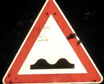 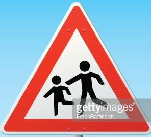 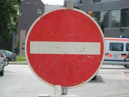 
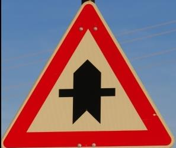 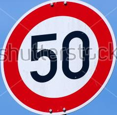 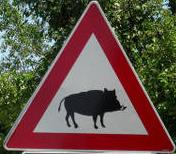

The bumpy road, Children Crossing, Right of way at next intersection and Wild animal crossing all have complex (non-linear) shapes that can be difficult for the neural network to classify. The speed limit sign was chosen as an easier bench mark test. The no entry sign has some noise in the background that can make it difficult to be classified.

####2. Discuss the model's predictions on these new traffic signs and compare the results to predicting on the test set. Identify where in your code predictions were made. At a minimum, discuss what the predictions were, the accuracy on these new predictions, and compare the accuracy to the accuracy on the test set (OPTIONAL: Discuss the results in more detail as described in the "Stand Out Suggestions" part of the rubric).

The images are imported in cell 19, preprocessed and predicted in cell 20. A forward pass is done on the logits defined in the model, and an argmax() function is used to derive the predicted labels from the predicted logits.

Here are the results of the prediction:

| Image			                               	|Prediction			    			|
|:---------------------------------------------:|:---------------------------------:|
| Bumpy road      		                        | Bumpy road   						|
| Children crossing								| Children crossing	   				|		
| No entry										| No entry		 	    			|
| Right of way at next intersection	      		| Right of way at next intersection	|
| Speed limit 50kph			                    | Speed limit 50kph   				|
| Wild animal crossing   	                    | Slippery Road      				|

The model was able to correctly guess 5 of the 6 traffic signs, which gives an accuracy of 83%. This compares favorably to the accuracy on the test set of 92%. The wild animal crossing was the hardest to classify, as a complex boar shape is non-linear. It can be inferred that in this case, the color and the shape of the traffic sign (red, triangle) were identified. However, the shape was construed to be a car, rather than an animal.

####3. Describe how certain the model is when predicting on each of the five new images by looking at the softmax probabilities for each prediction and identify where in your code softmax probabilities were outputted. Provide the top 5 softmax probabilities for each image along with the sign type of each probability. (OPTIONAL: as described in the "Stand Out Suggestions" part of the rubric, visualizations can also be provided such as bar charts)

The code for making predictions on my final model is located in the 21st cell of the Ipython notebook.

For the first image, the model is relatively sure correct prediction of a bumpy road sign (probability of 0.65). The top five soft max probabilities were

| Probability         	|     Prediction	        					|
|:---------------------:|:---------------------------------------------:|
| .65         			| Bumpy road   									|
| .2     				| Road Work 									|
| 0.06 					| Keep Left										|
| 0.02 	      			| Keep Right									|
| 0.007				    | No Passing     								|

For the second, third, fourth and fifth images, the model is extremely certain about the prediction.

| Probability         	|     Prediction	        					|
|:---------------------:|:---------------------------------------------:|
| 0.99         			| Children crossing (2nd image)					|
| 1     				| No entry (3rd image)							|
| 1 					| Right of way at next intersection	(4th image)	|
| 0.99					| 50 kph speed limit (5th image)				|

This could either be due to extremely clear input images, or due to images that are extremely similar to the training set images. This could potential indicate an over fit. The next steps to improve the model would be to add drop outs.

Sixth image
For the sixth image, the network is 44% sure that it is a slippery road sign. However, the image input was that of a wild animal crossing. The wrong classification could be due to the fact that the wild animal crossing has non-linear shapes that the network might find hard to classify. It could also be due to under representation of this particular traffic sign in the training set.

| Probability         	|     Prediction	        					|
|:---------------------:|:---------------------------------------------:|
| .44         			| Slippery road   								|
| .33     				| Bumpy road 									|
| 0.21 					| No passing for vehicle over 3.5mT				|
| 0.006 	      		| Wild animal crossing							|
| 0.005				    | Bicycles crossing    							|

###Next Steps
In order to increase the accuracy better, I would do the following next steps:
1. Increase the depth of the layers till I can notice overfitting (an increase in validation loss after a certain number of epochs) and then add drop outs after over fitting
2. Explore the usage of different mu and sigma for the initial weight distribution
3. Check which signs are under represented and augment the training set with traffic signs of those type.
4. Augment data by adding rotated/ noisy versions of the training set.
